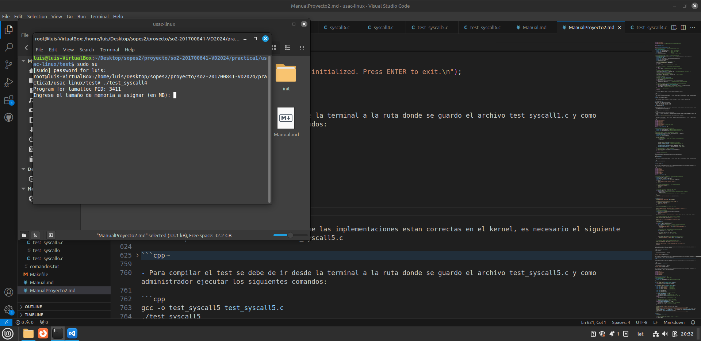
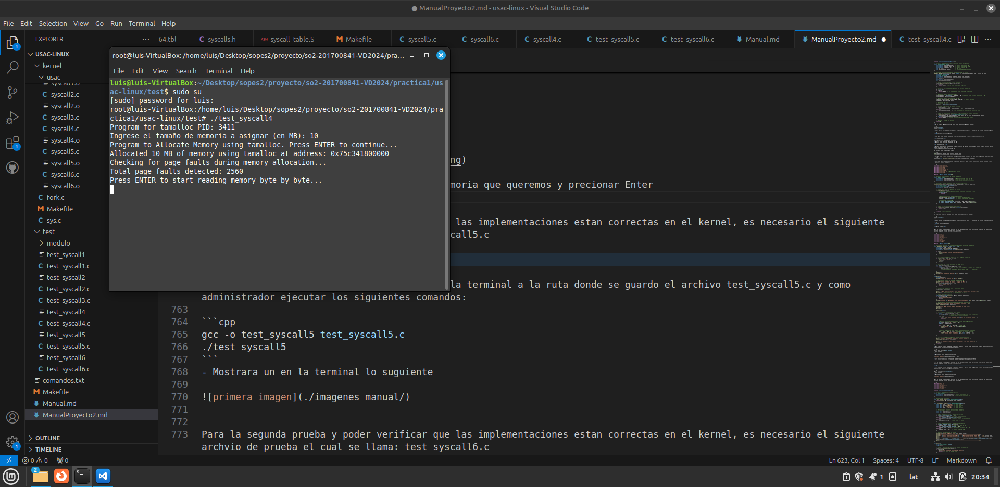
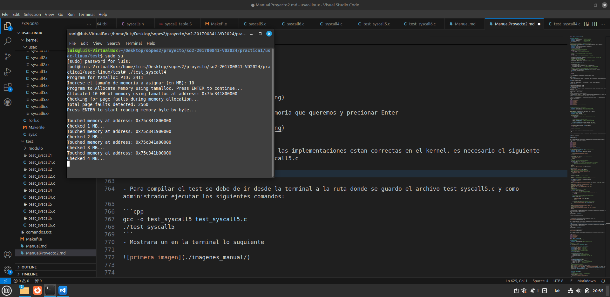
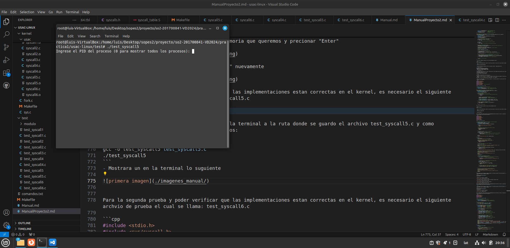
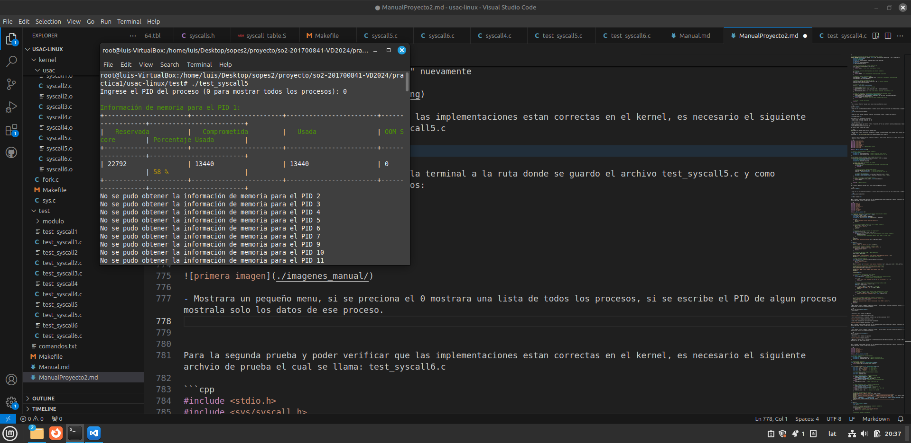
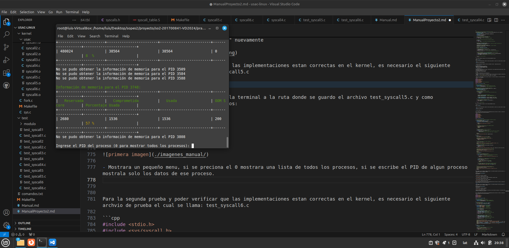
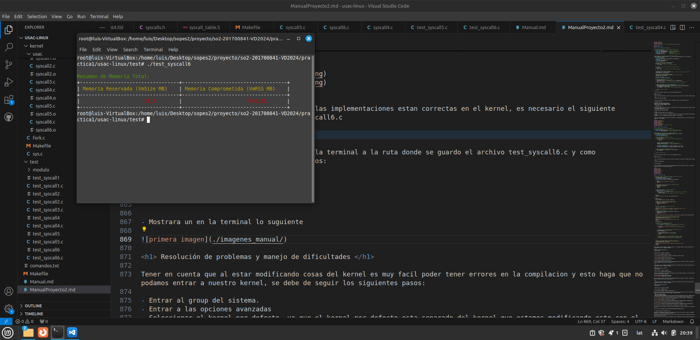

#### Universidad de San Carlos de Guatemala
#### Facultad de Ingenieria
#### Sistemas Operativos 2
#### Auxiliar: Brian Matus
<br><br><br><br><br><br><br>
<p style="text-align: center;"><strong> Proyecto2 <br>
</strong></p>
<br><br><br><br><br><br><br>

| Nombre                              | Carnet    |
| :---:                               |  :----:  |
| Luis Antonio Cutzal Chalí   | 201700841 |

<br><br>

---


<h1>Introducción</h1>

El kernel es la base sobre la cual todo el sistema se construye. En el caso de Linux, uno de los aspectos más interesantes es la posibilidad de personalizar y modificar el kernel para adaptarlo a necesidades específicas

Este proyecto busca brindar a los estudiantes la oportunidad de adentrarse en este mundo, ofreciéndoles una experiencia práctica en la modificación del kernel de Linux. A través de una máquina virtual, podrán hacer cambios controlados, como modificar el nombre del sistema, personalizar los mensajes de arranque o crear módulos que proporcionen estadísticas del sistema

En definitiva, este proyecto les brindará una comprensión más profunda del funcionamiento de Linux y les ofrecerá valiosas habilidades para su desarrollo profesional

<h1>Objetivo General</h1>

+ Desarrollar un asignador de memoria que inicialice memoria en 0 u otro char predeterminado
sin reservar páginas físicas inmediatamente

<h1>Objetivos específicos</h1>

+ Comprender los principios de asignación de memoria, páginas físicas, RSS, memoria reservada y
memoria alojada.
+ Implementar técnicas de control de acceso a páginas que fueron reservadas con este nuevo
asignador.
+ Entender el concepto de lazy-loading, lazy-init, lazy-zeroing.
+ Entender mapping de memoria virtual con masks como MAP_NORESERVE, MAP_PRIVATE y
MAP_ANONYMOUS
+ Adquirir experiencia práctica en la manipulación y modificación del kernel de Linux para la
gestión de memoria.


<h1> Cronograma </h1>

| **Día** | **Actividad**                                      |
|---------|----------------------------------------------------|
| Día 1   | Investigación de algoritmos de asignación de memoria.     |
| Día 2-4   | Diseño e implementación del algoritmo de asignación con lazy-zeroing.      |
| Día 5-6   | Desarrollo de la recolección de estadísticas generales de memoria      |
| Día 6-7 |  Integración en el kernel, pruebas finales y elaboración del informe técnico.         |
| Día 7   |  Resolución de errores y detalles e implementación final con las pruebas.   |


<h1>Pasos previos a modificar caracteristicas</h1>

+ Descargar la version 6.8.0 desde la pagina : www.kernel.org (descargar el tarball)

+ Descomprimir el kernel en una maquina virtual (Recomendable para evitar dañar nuestro sistema)

<h1> Instalar las dependencias </h1>

- sudo apt-get install build-essential libncurses5-dev fakeroot wget bzip2 openssl
- sudo apt-get install build-essential libncurses-dev bison flex libssl-dev libelf-dev

si les sale un error de que kernel-package no existe. De ser asi, solo quitenlo de la lista
- sudo apt-get install build-essential kernel-package libncurses5-dev fakeroot wget bzip2 openssl
- sudo apt-get install build-essential libncurses-dev bison flex libssl-dev libelf-dev

Si se topan con el error:
make[3]: *** No rule to make target 'debian/canonical-certs.pem', needed by 'certs/x509_certificate_list'.  Stop.

Ejecutar esto en la raiz del proyecto:

- scripts/config --disable SYSTEM_TRUSTED_KEYS
- scripts/config --disable SYSTEM_REVOCATION_KEYS

Comando para crear un acceso directo a los archivos
ln -s < archivo real > < nombre sylim >  


Copiar el archivo de config por primera vez
+ cp -v /boot/config-$(uname -r) .config

Limpiar el ambiente de compilacion
+ make clean

Modificar la version del kernel en el archivo Makefile que esta en la raiz

Hasta arriba, estara asi:

+ EXTRAVERSION = 
+ EXTRAVERSION = -49-usac1

Ahora te podes guiar del script "compile_and_install.sh" para compilar e instalar

Lo marcas con "chmod +x compile_and_install.sh" para permitir que se ejecute
+ ./compile_and_install.sh

+ Le damos que No a los primeros 3 comandos, los siguintes le damos Si excepto el ultimo comando.


```cpp
#!/bin/bash

compilation_command="make -j$(nproc --ignore=1)"
# If having problems with compilation, activate verbose mode for more info in console
#compilation_command="make -j$(nproc --ignore=1) V=1"
#compilation_command="sleep 3" # for testing

declare -a pre_compile_commands=(
    "make clean:N"
    "make oldconfig:N"
    "make menuconfig:N"
    "make localmodconfig:N"
)

declare -a post_compile_commands=(
    "make modules_install:Y"
    "make install:Y"
    "make headers_install:Y"
    "update-grub2:N"
)
########################################################################################################################
############################################################Helper Functions############################################
########################################################################################################################

ask_question() {
    local command=$1
    local default=$2
    local default_display="[Y/n]"

    if [[ "$default" == "N" ]]; then
        default_display="[y/N]"
    fi

    printf "Do you want to run '%s'? %s: " "$command" "$default_display" >&2
    read -r answer
    answer=$(echo "$answer" | xargs) # Trim whitespaces

    # If no input
    if [[ -z "$answer" ]]; then
        answer=$default
    fi

    # Normalize answer
    answer=$(echo "$answer" | tr '[:lower:]' '[:upper:]')

    echo "$answer"
}


process_commands() { #Split command and default behavior
    local commands=("$@")
    for entry in "${commands[@]}"; do
        local command=${entry%:*}
        local default=${entry#*:}

        answer=$(ask_question "$command" "$default")
        if [[ "$answer" == "Y" ]]; then
            echo "Running '$command'..."
            eval "$command"
        else
            echo "Skipping '$command'."
        fi
    done
}


echo "Compilation helper script started"
process_commands "${pre_compile_commands[@]}"
############################################################Compilation#################################################
# 
# Capture start time
start_time=$(date +%s)
start_time_full=$(date)

echo "Compiling with command: $compilation_command"
eval $compilation_command

# Check if it was successful
if [[ $? -ne 0 ]]; then
    echo "Compilation failed. Skipping further steps."
    exit 1
fi
echo "Compilation successful."

echo "Starting time: $start_time_full"
end_time=$(date +%s)
echo "Ending time: $(date)"
elapsed_time=$((end_time - start_time)) # in seconds
elapsed_minutes=$(echo "scale=2; $elapsed_time / 60" | bc) # in minutes

echo "Compilation took $elapsed_time seconds ($elapsed_minutes minutes)"
########################################################################################################################
process_commands "${post_compile_commands[@]}"

```

<h1>Implementación de nuevas llamadas al sistema</h1>

<h2>Tamalloc con lazy-zeroing</h2>

- Este algoritmo es una variación del asignador de memoria malloc. Su principal
diferencia es la inicialización del espacio de memoria en 0. En esto tiene más
parecido a kzalloc, calloc y parecidos. La diferencia principal con estos
asignadores de memoria, es qué Tamalloc debe estar diseñado para NO reservar
páginas físicas inmediatamente al momento de asignar memoria. Debe ser
hasta el primer acceso a cada página (ya sea escritura o lectura) que cause un
page fault, que esta región de página debe ser inicializada en 0.

## cumplir con los siguiente
- Asignar la memoria suficiente para abarcar la memoria solicitada
- No causar page faults al momento de asignar esta memoria
- Inicializar cada página en 0 hasta su primer acceso (lectura o escritura)


<h3> Implementación </h3>

- Primero sera crear la ruta para el archivo: "syscall_64.tbl" el cual contendra nuestra primera syscall, teniendo en cuenta que el archivo se ubica en
- arch/x86/entry/syscalls/syscall_64.tbl

se modifica hasta el final del archivo.

``` cpp
554 common luis_tamalloc sys_luis_tamalloc
```

<h4>Nota: tomar en cuenta que el número 554 puede variar dependiendo de la version de kernel, se recomienda utilizar ese número en adelante, tambien debe de agregar: "common" ya que es un abi "común", "64" o "x32" para este archivo. Por motivos de proyecto se agregó el nombre en este caso luis. Tambien es necesario solocar "sys" al nombre porque los talones __x64_sys_*() se crean sobre la marcha para las llamadas al sistema sys_*(). </h4>

- Crear la ruta para el archivo: "syscalls.h" el cual es la declaración de una nueva syscall personalizada para el kernel de Linux, la ruta completa seria:

- include/linux/syscalls.h

- Dentro de la ruta antes mencionada colocar el siguente comando

``` cpp
asmlinkage long sys_luis_tamalloc(size_t size);
```
- Crear una ruta para el archivo "Makefile" y agregar: obj-y += usac/ el cual se debe de encontrar antes de este comando: obj-$(CONFIG_MODULES) += module/, se modifica ese archivo porque se debe incluir el subdirectorio usac/ como parte del proceso de compilación del kernel.

- En el archvio "Makefile" ubicado en la ruta: kernel/usac/Makefile colocar:

```cpp
obj-y += syscall4.o
```

- Se crea una carpeta llamada usac y dentro de ella se coloca el archivo: "syscall4.c" con lo siguiente.

```cpp
#include <linux/kernel.h>   // Incluye definiciones básicas del kernel.
#include <linux/syscalls.h> // Proporciona macros y funciones para definir llamadas al sistema.
#include <linux/slab.h>     // Manejo de memoria en el espacio del kernel.
#include <linux/mm.h>       // Definiciones relacionadas con la memoria.
#include <linux/uaccess.h>  // Proporciona utilidades para acceder a la memoria del usuario.
#include <linux/mman.h>     // Define macros y funciones para la asignación de memoria.

SYSCALL_DEFINE1(luis_tamalloc, size_t, size) {
    // Verifica si el tamaño solicitado es 0
    if (size == 0) {
        return -EINVAL; // Devuelve un error de argumento inválido.
    }

    // Redondea el tamaño solicitado al múltiplo más cercano de PAGE_SIZE.
    // Esto asegura que la asignación sea compatible con el manejo de páginas de memoria.
    size_t rounded_size = PAGE_ALIGN(size);

    // Intenta reservar espacio de memoria en el espacio de usuario sin asignar
    // páginas físicas de inmediato. Esto mejora el rendimiento al diferir la asignación
    // hasta que se acceda a la memoria.
    void *user_memory = vm_mmap(
        NULL,                        // Dirección base (NULL permite que el sistema elija).
        0,                           // Offset inicial, debe ser 0 para MAP_ANONYMOUS.
        rounded_size,                // Tamaño del área a asignar.
        PROT_READ | PROT_WRITE,      // Permisos: lectura y escritura.
        MAP_ANONYMOUS | MAP_PRIVATE | MAP_NORESERVE, // Flags: anónimo, privado, sin reserva inmediata.
        0                            // Descriptor de archivo, no aplica para MAP_ANONYMOUS.
    );

    // Comprueba si la asignación de memoria falló.
    if (IS_ERR(user_memory)) {
        return PTR_ERR(user_memory); // Devuelve el código de error correspondiente.
    }

    // La siguiente línea (comentada) indica que la memoria se inicializaría a 0.
    // Sin embargo, debido a que vm_mmap no asigna páginas físicas inmediatamente,
    // esto podría no tener efecto en la práctica hasta que las páginas se accedan.
    // memset(user_memory, 0, rounded_size);

    // Devuelve al usuario la dirección virtual de la memoria asignada.
    // Nota: Es importante que el usuario libere este espacio de manera adecuada
    // cuando ya no sea necesario.
    return (long)user_memory;
}

```

- Como paso final debe de recompilar el kernel, utilizando el archivo: ./compile_and_install.sh


<h1>Recolección de estadísticas de asignación de memoria</h1>

## syscall recoleccion general

Descripción: Para CADA proceso individual:
- Memoria reservada (Reserved) (en KB/MB)
- Memoria utilizada (Commited) (en KB/MB, y en % de memoria reservada)
- OOM SCore

<h3> Implementación </h3>

- Modificar el archivo "syscall_64.tbl", agregarle la siguiente linea de codigo:

``` cpp
555 common luis_recoleccion_general sys_luis_recoleccion_general
```

- Agregar en el archivo "syscalls.h" lo siguiente y tomando en cuenta que debe de ser seguido de la anterior modificacion.
``` cpp
asmlinkage long sys_luis_recoleccion_general(pid_t pid);
```

- Dentro de la carpeta donde se creo el archivo "syscall4.c" se crea un nuevo archivo llamado "syscall5.c" con lo siguiente:

```cpp
#include <linux/kernel.h>
#include <linux/syscalls.h>
#include <linux/mm.h>
#include <linux/sched.h>
#include <linux/fs.h>
#include <linux/oom.h>
#include <linux/stat.h>
#include <linux/uaccess.h>  // Para la manipulación de datos de usuarios

#define KB (1024)
#define MB (1024 * 1024)

#define __NR_luis_recoleccion_general 555

// Estructura para almacenar la información de memoria del proceso
struct process_memory_info {
    unsigned long reserved_memory_kb;   // Memoria reservada en KB
    unsigned long committed_memory_kb;  // Memoria comprometida en KB
    unsigned long used_memory_kb;       // Memoria usada en KB
    int oom_score;                      // OOM score
    int percentage_used_memory;         // Porcentaje de memoria usada
};

// Función de la syscall que obtiene la información de un proceso
SYSCALL_DEFINE2(luis_recoleccion_general, pid_t, pid, struct process_memory_info __user *, mem_info) {
    struct task_struct *task;
    struct mm_struct *mm;
    unsigned long reserved_memory, committed_memory, used_memory_kb;
    int oom_score;
    unsigned long reserved_memory_kb;
    int percentage_used_memory;

    // Buscar el task_struct del proceso usando el PID
    task = pid_task(find_vpid(pid), PIDTYPE_PID);
    if (!task) {
        return -ESRCH;  // Error si no encontramos el proceso
    }

    // Obtener la estructura mm del proceso, que contiene la memoria
    mm = task->mm;
    if (!mm) {
        return -EFAULT;  // Si el proceso no tiene espacio de direcciones
    }

    // Obtener la memoria reservada (en KB)
    reserved_memory = mm->total_vm * PAGE_SIZE / KB;  // total_vm es en páginas, convertimos a KB
    reserved_memory_kb = reserved_memory;

    // Obtener la memoria utilizada (RSS, en KB)
    committed_memory = get_mm_rss(mm) * PAGE_SIZE / KB;  // memoria residente
    used_memory_kb = committed_memory;

    // Obtener el OOM score
    oom_score = task->signal->oom_score_adj;

    // Calcular el porcentaje de memoria utilizada
    if (reserved_memory > 0) {
        percentage_used_memory = (used_memory_kb * 100) / reserved_memory_kb;
    } else {
        percentage_used_memory = 0;  // Si no hay memoria reservada, el porcentaje es 0
    }

    // Copiar los resultados a la estructura proporcionada por el espacio de usuario
    if (copy_to_user(mem_info, &(struct process_memory_info) {
        reserved_memory_kb, committed_memory, used_memory_kb, oom_score, percentage_used_memory
    }, sizeof(struct process_memory_info))) {
        return -EFAULT;  // Error al copiar los datos al espacio de usuario
    }

    // Retornar 0 si todo fue exitoso
    return 0;
}
```
- En el archvio "Makefile" ubicado en la ruta: kernel/usac/Makefile colocar:

```cpp
obj-y += syscall5.o
```
- Crear la ruta microblaze/kernel y dentro el archivo syscall_table.S y colocar en las ultimas lineas el siguiente comando:

```cpp
.long sys_luis_recoleccion_general
```

- Como paso final debe de recompilar el kernel, utilizando el archivo: ./compile_and_install.sh

<h2>resumen_total</h2>

Descripción: Para CADA proceso individual:
- Memoria total reservada (Reserved) (en MB)
- Memoria total utilizada (Commited) (en MB)

<h3> Implementación </h3>

- Primero sera crear la ruta para el archivo: "syscall_64.tbl" el cual contendra nuestra primera syscall, teniendo en cuenta que el archivo se ubica en
- arch/x86/entry/syscalls/syscall_64.tbl

Se modifica hasta el final del archivo.

``` cpp
556 common luis_resumen_total sys_luis_resumen_total
```
- Agregar en el archivo "syscalls.h" lo siguiente y tomando en cuenta que debe de ser seguido de la anterior modificacion.
``` cpp
asmlinkage long sys_luis_resumen_total(struct memory_summary __user *summary);
```

- Dentro de la carpeta donde se creo el archivo "syscall4.c" y el archivo "syscall5.c" se crea un nuevo archivo llamado "syscall6.c" con lo siguiente:

```cpp
#include <linux/kernel.h>
#include <linux/syscalls.h>
#include <linux/mm.h>
#include <linux/fs.h>
#include <linux/uaccess.h>
#include <linux/slab.h>
#include <linux/sched.h>  // Para for_each_process
#include <linux/fs.h>

#define __NR_luis_resumen_total 556 

// Definir la estructura para el resumen de memoria
struct memory_summary {
    unsigned long reserved_memory_mb;  // Memoria reservada total (en MB)
    unsigned long committed_memory_mb; // Memoria comprometida total (en MB)
};

// Función para obtener la memoria total de todos los procesos
SYSCALL_DEFINE1(luis_resumen_total, struct memory_summary __user *, summary) {
    struct memory_summary sys_summary = {0};
    struct task_struct *task;
    unsigned long reserved, committed;

    // Iterar sobre todos los procesos del sistema
    for_each_process(task) {
        // Asegurarse de que el proceso tiene un espacio de direcciones válido
        if (!task->mm) {
            continue;
        }

        // Obtener los valores de memoria del proceso
        reserved = get_mm_rss(task->mm);  // Memoria residente (RSS)
        committed = task->mm->total_vm;   // Memoria comprometida (Total VM)

        // Convertir de páginas a MB
        sys_summary.reserved_memory_mb += reserved * PAGE_SIZE / (1024 * 1024);
        sys_summary.committed_memory_mb += committed * PAGE_SIZE / (1024 * 1024);
    }

    // Copiar el resultado a la memoria del usuario
    if (copy_to_user(summary, &sys_summary, sizeof(sys_summary))) {
        return -EFAULT;
    }

    return 0; // Retorno exitoso
}
```
En el archvio "Makefile" ubicado en la ruta: kernel/usac/Makefile colocar:

```cpp
obj-y += syscall6.o
```

- Crear la ruta microblaze/kernel y dentro el archivo syscall_table.S y colocar en las ultimas lineas el siguiente comando:

```cpp
.long sys_luis_resumen_total
```

<h1>Hacer pruebas</h1>


Para la primera prueba y poder verificar que las implementaciones estan correctas en el kernel, es necesario el siguiente archvio de prueba el cual se llama: test_syscall4.c

```cpp
#include <stdio.h>
#include <stdlib.h>
#include <unistd.h>
#include <sys/syscall.h>
#include <errno.h>
#include <time.h>
#include <sys/mman.h>
#include <string.h>

#define __NR_luis_tamalloc 554

// Función para verificar los "page faults" durante la asignación de memoria
void check_page_faults(void *start, size_t size) {
    unsigned char *addr = start;
    size_t page_size = sysconf(_SC_PAGE_SIZE);
    unsigned char *vec = (unsigned char *)malloc(size / page_size);
    
    if (!vec) {
        perror("Failed to allocate vector for mincore");
        exit(1);
    }

    // Verificamos las páginas para ver si están cargadas en memoria
    if (mincore(addr, size, vec) == -1) {
        perror("mincore failed");
        free(vec);
        exit(1);
    }

    // Recorremos las páginas y contamos los "page faults"
    int page_fault_count = 0;
    for (size_t i = 0; i < size / page_size; i++) {
        if (vec[i] == 0) {  // Si el bit es 0, significa que la página no está en memoria
            page_fault_count++;
            //printf("Page fault detected at address: %p\n", addr + i * page_size);
        }
    }
    free(vec);
    printf("Total page faults detected: %d\n", page_fault_count);
}

int main() {
    size_t total_size;
    printf("Program for tamalloc PID: %d\n", getpid());

    // Solicitar al usuario el tamaño de la memoria en MB
    printf("Ingrese el tamaño de memoria a asignar (en MB): ");
    if (scanf("%zu", &total_size) != 1) {
        perror("Invalid input");
        return 1;
    }

    // Convertir de MB a bytes (1 MB = 1024 * 1024 bytes)
    total_size *= 1024 * 1024;

    printf("Program to Allocate Memory using tamalloc. Press ENTER to continue...\n");
    getchar(); // Para consumir el '\n' que queda en el buffer

    // Usamos la syscall tamalloc
    char *buffer = (char *)syscall(__NR_luis_tamalloc, total_size);
    if ((long)buffer < 0) {
        perror("tamalloc failed");
        return 1;
    }
    printf("Allocated %zu MB of memory using tamalloc at address: %p\n", total_size / (1024 * 1024), buffer);

    // Verificamos si se causaron "page faults" durante la asignación
    printf("Checking for page faults during memory allocation...\n");
    check_page_faults(buffer, total_size);

    printf("Press ENTER to start reading memory byte by byte...\n");
    getchar();

    srand(time(NULL));

    // Verificamos la inicialización de la memoria
    for (size_t i = 0; i < total_size; i++) {
        char t = buffer[i]; // Esto activa la asignación perezosa (lazy allocation) 
                             // y debería estar inicializada a 0.
        if (t != 0) {
            printf("ERROR FATAL: Memory at byte %zu was not initialized to 0\n", i);
            return 10;
        }

        // Escribir un carácter aleatorio para activar Copy-on-Write (CoW)
        char random_letter = 'A' + (rand() % 26);
        buffer[i] = random_letter;

        if (i % (1024 * 1024) == 0 && i > 0) { // Cada 1MB
            printf("Checked %zu MB...\n", i / (1024 * 1024));
            sleep(1);
        }

        // Imprimir la dirección de la memoria tocada para observar el proceso
        if (i % (1024 * 1024) == 0) { // Cada 1MB para no inundar la salida
            printf("Touched memory at address: %p\n", (void *)(buffer + i));
        }
    }

    // Verificar las páginas cargadas en la memoria usando mincore
    printf("Verifying memory pages loaded into physical memory...\n");
    check_page_faults(buffer, total_size);

    printf("All memory verified to be zero-initialized. Press ENTER to exit.\n");
    getchar();
    return 0;
}
```
- Para compilar el test se debe de ir desde la terminal a la ruta donde se guardo el archivo test_syscall1.c y como administrador ejecutar los siguientes comandos:

```cpp
gcc -o test_syscall4 test_syscall4.c
./test_syscall4
```

- Mostrara un en la terminal lo suguiente



- sera necesario escribir el tamaño de la memoria que queremos y precionar "Enter"



- como ultimo paso precionar la tecla "Enter" nuevamente 



Para la segunda prueba y poder verificar que las implementaciones estan correctas en el kernel, es necesario el siguiente archvio de prueba el cual se llama: test_syscall5.c

```cpp
#include <stdio.h>
#include <sys/syscall.h>
#include <unistd.h>
#include <sys/types.h>
#include <stdlib.h>
#include <dirent.h>
#include <string.h>
#include <ctype.h>

#define __NR_luis_recoleccion_general 555

// Estructura para almacenar la información de memoria
struct process_memory_info {
    unsigned long reserved_memory_kb;
    unsigned long committed_memory_kb;
    unsigned long used_memory_kb;
    int oom_score;
    int percentage_used_memory;
};

// Declaración de la syscall
long luis_recoleccion_general(pid_t pid, struct process_memory_info *mem_info) {
    return syscall(__NR_luis_recoleccion_general, pid, mem_info);
}

// Función para imprimir las estadísticas de memoria en formato de tabla con colores
void print_memory_info(struct process_memory_info mem_info, pid_t pid) {
    // Colores ANSI
    const char* green = "\033[32m";
    const char* yellow = "\033[33m";
    const char* red = "\033[31m";
    const char* reset = "\033[0m";

    // Calcular el color de porcentaje de memoria usada
    const char* used_color;
    if (mem_info.percentage_used_memory < 50) {
        used_color = green;
    } else if (mem_info.percentage_used_memory < 80) {
        used_color = yellow;
    } else {
        used_color = red;  // Rojo para alta utilización
    }

    // Imprimir la tabla con colores
    printf("\n%sInformación de memoria para el PID %d:%s\n", green, pid, reset);
    printf("+----------------------+------------------------+------------------------+------------------+-------------------------+\n");

    // Encabezado sin colores
    printf("|   %sReservada%s          |   %sComprometida%s         |   %sUsada%s                | %sOOM Score%s        | %sPorcentaje Usada%s        |\n", 
           green, reset, green, reset, green, reset, green, reset,green, reset);  // Primera fila con colores
    printf("+----------------------+------------------------+------------------------+------------------+-------------------------+\n");

    // Imprimir los valores con los colores aplicados solo a los valores dinámicos
    printf("| %-20lu | %-22lu | %-22lu | %-16d | %s%-3d%%%s                    |\n",
           mem_info.reserved_memory_kb,
           mem_info.committed_memory_kb,
           mem_info.used_memory_kb,
           mem_info.oom_score,
           used_color, mem_info.percentage_used_memory, reset); // Datos de la fila
    printf("+----------------------+------------------------+------------------------+------------------+-------------------------+\n");
}

// Función para obtener todos los PIDs del sistema
void get_all_pids_and_show_memory() {
    DIR *dir = opendir("/proc");
    struct dirent *entry;
    struct process_memory_info mem_info;
    pid_t pid;
    long result;

    if (dir == NULL) {
        perror("No se pudo abrir el directorio /proc");
        return;
    }

    // Leer todos los directorios en /proc
    while ((entry = readdir(dir)) != NULL) {
        // Verificar si el nombre del directorio es un número (PID)
        if (isdigit(entry->d_name[0])) {
            pid = atoi(entry->d_name);  // Convertir el nombre a un PID

            // Llamar a la syscall para obtener la recolección de memoria
            result = luis_recoleccion_general(pid, &mem_info);
            if (result < 0) {
                printf("No se pudo obtener la información de memoria para el PID %d\n", pid);
                continue;
            }

            // Mostrar la información de memoria para ese proceso
            print_memory_info(mem_info, pid);
        }
    }

    closedir(dir);
}

int main() {
    pid_t pid;
    struct process_memory_info mem_info;
    long result;

    while (1) {
        // Solicitar el PID
        printf("Ingrese el PID del proceso (0 para mostrar todos los procesos): ");
        scanf("%d", &pid);

        if (pid == 0) {
            // Si el PID es 0, mostrar todos los procesos
            get_all_pids_and_show_memory();
        } else if (pid < 0) {
            // Verificar si se ingresa un PID inválido
            printf("PID no válido.\n");
            printf("Saliendo...\n");
            return 0;
        }else {
            // Si se ingresa un PID específico
            result = luis_recoleccion_general(pid, &mem_info);
            if (result < 0) {
                printf("Proceso con PID %d terminado o no encontrado.\n", pid);
            } else {
                // Mostrar la información de memoria para el PID ingresado
                print_memory_info(mem_info, pid);
            }
        }

        // Preguntar nuevamente
        printf("\n");
    }

    return 0;
}

```

- Para compilar el test se debe de ir desde la terminal a la ruta donde se guardo el archivo test_syscall5.c y como administrador ejecutar los siguientes comandos:

```cpp
gcc -o test_syscall5 test_syscall5.c
./test_syscall5
```
- Mostrara un en la terminal lo suguiente



- Mostrara un pequeño menu, si se preciona el 0 mostrara una lista de todos los procesos, si se escribe el PID de algun proceso mostrala solo los datos de ese proceso.





Para la tecera prueba y poder verificar que las implementaciones estan correctas en el kernel, es necesario el siguiente archvio de prueba el cual se llama: test_syscall6.c

```cpp
#include <stdio.h>
#include <sys/syscall.h>
#include <unistd.h>
#include <sys/types.h>
#include <stdlib.h>

#define __NR_luis_resumen_total 556

// Estructura para almacenar la memoria total
struct memory_summary {
    unsigned long reserved_memory_mb; // Memoria reservada en MB
    unsigned long committed_memory_mb; // Memoria comprometida en MB
};

// Declaración de la syscall
long luis_resumen_total(struct memory_summary *summary) {
    return syscall(__NR_luis_resumen_total, summary);
}

void print_memory_summary(struct memory_summary summary) {
    const char* green = "\033[32m";   // Color verde
    const char* yellow = "\033[33m";  // Color amarillo
    const char* red = "\033[31m";     // Color rojo
    const char* reset = "\033[0m";    // Reset de color

    // Variables para el color de las columnas de memoria
    const char* reserved_color;
    const char* committed_color;

    // Lógica para asignar color a la memoria reservada
    if (summary.reserved_memory_mb < 1024) {
        reserved_color = green;  // Verde si es menos de 1GB
    } else if (summary.reserved_memory_mb < 2048) {
        reserved_color = yellow; // Amarillo si está entre 1GB y 2GB
    } else {
        reserved_color = red;    // Rojo si es más de 2GB
    }

    // Lógica para asignar color a la memoria comprometida
    if (summary.committed_memory_mb < 1024) {
        committed_color = green;  // Verde si es menos de 1GB
    } else if (summary.committed_memory_mb < 2048) {
        committed_color = yellow; // Amarillo si está entre 1GB y 2GB
    } else {
        committed_color = red;    // Rojo si es más de 2GB
    }

    // Imprimir la información con colores
    printf("\n%sResumen de Memoria Total:%s\n", green, reset);
    printf("+----------------------------------+------------------------------------+\n");
    printf("| %sMemoria Reservada (VmSize MB)%s    | %sMemoria Comprometida (VmRSS MB)%s    |\n", yellow, reset, yellow, reset);
    printf("+----------------------------------+------------------------------------+\n");
    printf("| %-26s%-4lu%s        | %-26s%-4lu%s       |\n", reserved_color, summary.reserved_memory_mb, reset, committed_color, summary.committed_memory_mb, reset);
    printf("+----------------------------------+------------------------------------+\n");
}

int main() {
    struct memory_summary summary;
    long result;

    // Llamar a la syscall para obtener el resumen de la memoria
    result = luis_resumen_total(&summary);
    if (result < 0) {
        perror("Error al obtener el resumen de memoria");
        return -1; // Salir en caso de error
    }

    // Mostrar el resumen de la memoria
    print_memory_summary(summary);

    return 0;
}
```

- Para compilar el test se debe de ir desde la terminal a la ruta donde se guardo el archivo test_syscall6.c y como administrador ejecutar los siguientes comandos:

```cpp
gcc -o test_syscall6 test_syscall6.c
./test_syscall6
```

- Mostrara un en la terminal lo suguiente



<h1> Resolución de problemas y manejo de dificultades </h1>

Tener en cuenta que al estar modificando cosas del kernel es muy facil poder tener errores en la compilacion y esto haga que no podamos entrar a nuestro kernel, se debe de seguir los siguientes pasos:

- Entrar al group del sistema.
- Entrar a las opciones avanzadas
- Seleccionar el kernel por defecto, ya que el kernel por defecto esta separado del kernel que estamos modificando esto con el fin de poder tener un mejor control de los posibles errores y no se tenga que eliminar la maquina virtual.


Otro de los problemas puede ser que aparezca lo siguiente:


Esto sucede porque en el archivo syscall_64.tbl no esta la llamada del syscall,se debe de colocar las llamadas de las llamadas al sistema

<h1> Reflexión personal y autoevaluación</h1>

+ Tome en cuenta la reflexion del proyecto pasado, leí varias veces el enunciado y pregunte al auxiliar en los laboratorios sobre todas mis dudas y problemas.

+ Gracias a la ayuda y guia del auxiliar logre completar de manera efectiva el proyecto2 y sobre todo en base a una investigación detallada sobre lo que debo hacer y luego comenzar con la implementación y las pruebas correspondientes.

+ También debo evitar pensar en todo lo que se debe de hacer en el enunciado, ya que esto me genera ansiedad, pereza y estrés. Es mejor abordarlo poco a poco. Dividir el proyecto en tareas más pequeñas me permitirá avanzar de manera más ordenada y menos abrumada.
